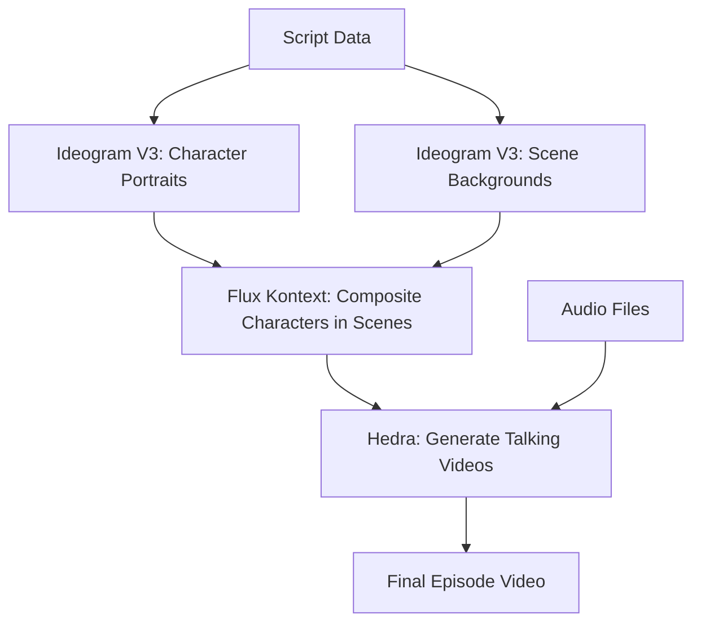

# fal.ai API Integration Guide

## Overview

This guide covers the integration of fal.ai's latest APIs for video generation, including Ideogram V3, Flux Kontext Multi, and Hedra Character-2.

## API Models Used

### 1. Ideogram V3 (`fal-ai/ideogram/v3`)

**Purpose**: High-quality text-to-image generation for characters and scenes

**Key Features**:
- Multiple rendering speeds: TURBO, BALANCED, QUALITY
- Style options: AUTO, GENERAL, REALISTIC, DESIGN
- Magic prompt expansion
- Style reference support (up to 3 images)

**Usage Example**:
```python
import fal_client

result = await fal_client.submit_async(
    "fal-ai/ideogram/v3",
    arguments={
        "prompt": "professional portrait of a tech entrepreneur",
        "negative_prompt": "cartoon, anime, low quality",
        "image_size": "square_hd",
        "rendering_speed": "BALANCED",
        "style": "REALISTIC",
        "expand_prompt": True,
        "num_images": 1
    }
)
```

**Image Size Options**:
- `square_hd`, `square`
- `portrait_4_3`, `portrait_16_9`
- `landscape_4_3`, `landscape_16_9`
- Custom sizes: `{"width": 1280, "height": 720}`

### 2. Flux Kontext Multi (`fal-ai/flux-pro/kontext/multi`)

**Purpose**: Compositing multiple images (character + background)

**Key Features**:
- Combines multiple images naturally
- Maintains lighting and perspective
- Flexible positioning with prompts

**Usage Example**:
```python
result = await fal_client.submit_async(
    "fal-ai/flux-pro/kontext/multi",
    arguments={
        "prompt": "Place the person naturally in the office scene",
        "image_urls": [
            background_url,  # Scene background
            character_url    # Character to place
        ],
        "guidance_scale": 3.5,
        "num_images": 1,
        "output_format": "png",
        "aspect_ratio": "16_9"
    }
)
```

### 3. Hedra Character-2 (`fal-ai/hedra-character-2`)

**Purpose**: Generate talking head videos from image + audio

**Key Features**:
- Realistic lip-sync
- Natural head movements
- Maintains character appearance

**Usage Example**:
```python
# Upload audio first
with open(audio_path, 'rb') as f:
    audio_url = await fal_client.upload_async(f.read(), "audio/mpeg")

result = await fal_client.submit_async(
    "fal-ai/hedra-character-2",
    arguments={
        "image_url": character_image_url,
        "audio_url": audio_url,
        "aspect_ratio": "16_9"
    }
)
```

## Complete Pipeline Flow



## Setup Instructions

### 1. Install Dependencies

```bash
pip install fal-client
pip install aiohttp
pip install pillow
pip install loguru
```

### 2. Get API Key

1. Sign up at [fal.ai](https://fal.ai)
2. Go to [Dashboard](https://fal.ai/dashboard)
3. Create an API key
4. Set environment variable:

```bash
export FAL_API_KEY="your-api-key-here"
```

### 3. Test the APIs

```bash
# Test all APIs
python test_fal_api.py --test all

# Test specific API
python test_fal_api.py --test ideogram
python test_fal_api.py --test kontext
python test_fal_api.py --test hedra
```

## Updated Video Generator Features

### Visual Style Configuration

```python
from src.video.video_generator_v2 import VisualStyle

custom_style = VisualStyle(
    style_name="Custom",
    style_prompt="your style description",
    negative_prompt="what to avoid",
    rendering_speed="BALANCED",  # TURBO, BALANCED, QUALITY
    style_type="REALISTIC",       # AUTO, GENERAL, REALISTIC, DESIGN
    expand_prompt=True,
    aspect_ratio="16:9"
)
```

### Character Generation

```python
generator = VideoGeneratorV2()
generator.set_visual_style(PRESET_STYLES_V2["cinematic"])

# Generate character portrait
character_image = await generator.generate_character_image(
    character_name="Alex Chen",
    character_prompt="young tech entrepreneur, professional, confident"
)
```

### Scene Composition

```python
# Generate background
scene_image = await generator.generate_scene_background(
    scene_number=1,
    environment_prompt="modern office, city view"
)

# Composite character into scene
composite = await generator.composite_character_in_scene(
    scene_number=1,
    character_name="Alex Chen",
    position_prompt="standing at the window, looking thoughtful"
)
```

### Video Generation

```python
# Generate talking video with Hedra
video = await generator.generate_talking_video_with_hedra(
    character_name="Alex Chen",
    scene_number=1,
    audio_path="dialogue_audio.mp3"
)
```

## API Response Formats

### Ideogram V3 Response
```json
{
  "images": [
    {
      "url": "https://v3.fal.media/files/..."
    }
  ],
  "seed": 123456
}
```

### Flux Kontext Response
```json
{
  "images": [
    {
      "url": "https://fal.media/files/...",
      "content_type": "image/png",
      "width": 1920,
      "height": 1080
    }
  ]
}
```

### Hedra Response
```json
{
  "video": {
    "url": "https://fal.media/files/...mp4",
    "duration": 5.2
  }
}
```

## Best Practices

### 1. Image Quality
- Use `QUALITY` rendering speed for final production
- Use `TURBO` for quick previews
- Always provide detailed prompts

### 2. Compositing
- Ensure character and background have similar lighting
- Use clear positioning prompts
- Match aspect ratios

### 3. Video Generation
- Provide high-quality audio (MP3, 44.1kHz)
- Use frontal face images for best results
- Keep audio clips under 30 seconds for optimal processing

### 4. Error Handling
```python
try:
    result = await fal_client.submit_async(...)
except Exception as e:
    logger.error(f"API call failed: {e}")
    # Implement fallback logic
```

### 5. Rate Limiting
- Implement exponential backoff for retries
- Cache generated assets to avoid redundant calls
- Use batch processing where possible

## Troubleshooting

### Common Issues

1. **API Key Not Working**
   - Verify key is active in dashboard
   - Check for typos in environment variable
   - Ensure proper billing setup

2. **Image Generation Fails**
   - Check prompt for prohibited content
   - Verify image size is supported
   - Reduce prompt complexity

3. **Video Generation Times Out**
   - Hedra can take 2-5 minutes
   - Implement async waiting with timeout
   - Consider fallback to static images

4. **Composite Looks Unnatural**
   - Improve positioning prompt
   - Ensure similar lighting/style
   - Try different guidance scales

## Cost Optimization

1. **Use Appropriate Quality Settings**
   - TURBO for testing (~$0.01/image)
   - BALANCED for preview (~$0.02/image)
   - QUALITY for final (~$0.04/image)

2. **Cache Everything**
   - Store generated images/videos
   - Reuse backgrounds across scenes
   - Cache character portraits

3. **Batch Processing**
   - Generate all characters at once
   - Process scenes in parallel
   - Queue video generation

## Alternative APIs

If fal.ai is unavailable, consider:

1. **Replicate** - Similar model hosting
2. **Stability AI** - Direct API access
3. **Runway ML** - Advanced video tools
4. **D-ID** - Specialized in talking heads
5. **HeyGen** - Avatar video generation

## Support

- fal.ai Documentation: https://fal.ai/docs
- Discord Community: https://discord.gg/fal-ai
- GitHub Issues: Report bugs in our repo