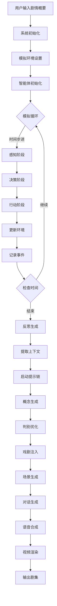

# Showrunner Agents 详细设计文档

> 基于Fable Studio论文《To Infinity and Beyond: SHOW-1 and Showrunner Agents in Multi-Agent Simulations》的Python实现

## 0. 核心创新点

### 0.1 解决的关键问题

1. **"老虎机效应"(Slot Machine Effect)**
   - 问题：AI内容生成感觉像随机游戏而非创造性过程
   - 解决：通过多智能体仿真提供上下文，延长生成-消费时间间隔

2. **"空白页问题"(Blank Page Problem)**
   - 问题：用户和LLM都难以从零开始创作
   - 解决：仿真提供"创意燃料"(Creative Fuel)

3. **"一万碗燕麦粥问题"(10,000 Bowls of Oatmeal)**
   - 问题：程序生成内容的感知相似性
   - 解决：通过长时仿真和人工稀缺性确保独特性

4. **不连续创造性任务**
   - 问题：故事生成需要"灵光一现"的非连续跳跃
   - 解决：提示链技术模拟创造性思维过程

### 0.2 技术创新

- **多智能体仿真**：提供丰富的上下文和行为控制
- **提示链(Prompt-Chaining)**：模拟慢思考和创造性评估
- **戏剧指纹(Dramatic Fingerprint)**：捕获IP特定风格
- **SHOW-1模型概念**：基于用户反馈的持续学习

## 1. 系统工作流详细设计

### 1.1 主工作流程图



### 1.2 详细步骤设计

## 2. 步骤1：智能体初始化

### 2.1 逻辑位置
- **输入**: 用户配置的角色设定
- **输出**: 初始化完成的智能体对象
- **依赖**: 无
- **下游**: 模拟循环

### 2.2 详细流程
```python
class AgentInitializer:
    def initialize_agent(self, config: Dict) -> CharacterAgent:
        # Step 1: 生成背景故事
        backstory = self.generate_backstory(config)
        
        # Step 2: 生成个性特征
        personality = self.generate_personality(config, backstory)
        
        # Step 3: 生成初始关系
        relationships = self.generate_relationships(config)
        
        # Step 4: 设置初始需求
        needs = self.initialize_needs()
        
        return CharacterAgent(
            backstory=backstory,
            personality=personality,
            relationships=relationships,
            needs=needs
        )
```

### 2.3 Prompt模板

```python
AGENT_INIT_PROMPTS = {
    "backstory_generation": """
    You are creating a character for a story simulation.
    
    Character name: {name}
    Character archetype: {archetype}
    Story genre: {genre}
    Basic traits: {traits}
    
    Generate a detailed backstory that includes:
    1. Early life and formative experiences
    2. Key relationships and how they shaped the character
    3. Major life events and turning points
    4. Current situation and motivations
    5. Hidden secrets or unresolved conflicts
    
    The backstory should:
    - Be internally consistent
    - Provide clear motivations for behavior
    - Create potential for interesting interactions
    - Include both strengths and vulnerabilities
    
    Output format:
    {
        "early_life": "...",
        "formative_experiences": [...],
        "relationships": {...},
        "turning_points": [...],
        "current_situation": "...",
        "motivations": [...],
        "secrets": [...],
        "fears": [...],
        "desires": [...]
    }
    """,
    
    "personality_generation": """
    Based on this backstory:
    {backstory}
    
    Generate a nuanced personality profile using the Big Five model plus additional story-relevant traits:
    
    1. Openness (0-1): Creativity, imagination, curiosity
    2. Conscientiousness (0-1): Organization, dependability, self-discipline  
    3. Extraversion (0-1): Sociability, assertiveness, energy
    4. Agreeableness (0-1): Trust, altruism, cooperation
    5. Neuroticism (0-1): Anxiety, moodiness, emotional instability
    
    Additional traits:
    - Courage (0-1)
    - Loyalty (0-1)
    - Ambition (0-1)
    - Empathy (0-1)
    - Humor (0-1)
    
    Consider how the backstory influences each trait.
    Ensure the personality creates interesting dramatic potential.
    
    Output format:
    {
        "big_five": {
            "openness": 0.X,
            "conscientiousness": 0.X,
            "extraversion": 0.X,
            "agreeableness": 0.X,
            "neuroticism": 0.X
        },
        "story_traits": {
            "courage": 0.X,
            "loyalty": 0.X,
            "ambition": 0.X,
            "empathy": 0.X,
            "humor": 0.X
        },
        "behavioral_tendencies": [
            "tends to...",
            "often...",
            "rarely..."
        ]
    }
    """
}
```

## 3. 步骤2：模拟循环

### 3.1 逻辑位置
- **输入**: 初始化的智能体、环境配置
- **输出**: 事件日志、智能体状态更新
- **依赖**: 智能体初始化
- **下游**: 反思生成

### 3.2 状态机设计

```python
from enum import Enum

class AgentState(Enum):
    IDLE = "idle"
    PERCEIVING = "perceiving"
    DECIDING = "deciding"
    ACTING = "acting"
    INTERACTING = "interacting"
    REFLECTING = "reflecting"

class SimulationStateMachine:
    def __init__(self):
        self.state = AgentState.IDLE
        self.transitions = {
            AgentState.IDLE: [AgentState.PERCEIVING],
            AgentState.PERCEIVING: [AgentState.DECIDING],
            AgentState.DECIDING: [AgentState.ACTING, AgentState.IDLE],
            AgentState.ACTING: [AgentState.INTERACTING, AgentState.IDLE],
            AgentState.INTERACTING: [AgentState.IDLE],
            AgentState.IDLE: [AgentState.REFLECTING, AgentState.PERCEIVING]
        }
```

### 3.3 感知阶段Prompt

```python
PERCEPTION_PROMPTS = {
    "environment_perception": """
    Agent: {agent_name}
    Current location: {location}
    Time: {time}
    Weather: {weather}
    
    Other agents present: {other_agents}
    Objects in environment: {objects}
    Recent events: {recent_events}
    
    Based on the agent's personality:
    {personality}
    
    What would this character notice and pay attention to?
    Consider:
    1. What aligns with their interests/goals
    2. What triggers their fears or desires
    3. What reminds them of past experiences
    4. Social dynamics they would pick up on
    
    Output format:
    {
        "noticed_agents": ["agent_id", ...],
        "noticed_objects": ["object", ...],
        "social_cues": ["cue", ...],
        "emotional_triggers": ["trigger", ...],
        "relevance_scores": {
            "agent_id": 0.X,
            "object": 0.X
        }
    }
    """
}
```

### 3.4 决策阶段

```python
DECISION_PROMPTS = {
    "action_decision": """
    Agent: {agent_name}
    Personality: {personality}
    Current needs: {needs}
    Current goals: {goals}
    
    Perceptions: {perceptions}
    Available actions: {available_actions}
    Recent interactions: {recent_interactions}
    
    Decide what action this character would take.
    
    Consider:
    1. Personality-driven preferences
    2. Need fulfillment priorities
    3. Goal advancement opportunities
    4. Social dynamics and relationships
    5. Risk vs reward based on personality
    
    Evaluate each available action:
    {
        "action": "action_name",
        "motivation": "why this action",
        "expected_outcome": "what they hope to achieve",
        "confidence": 0.X,
        "alternatives_considered": [...]
    }
    
    Choose the action with the highest weighted score based on:
    - Need fulfillment (weight: {need_weight})
    - Goal alignment (weight: {goal_weight})
    - Personality fit (weight: {personality_weight})
    - Social appropriateness (weight: {social_weight})
    """
}
```

## 4. 步骤3：反思生成（Reverie）

### 4.1 逻辑位置
- **输入**: 一天的事件日志、智能体记忆
- **输出**: 反思内容、更新的记忆权重
- **依赖**: 模拟循环完成
- **下游**: 上下文提取

### 4.2 反思生成流程

```python
class ReverieGenerator:
    def generate_reverie(self, agent: CharacterAgent, day_events: List[Event]):
        # Step 1: 事件重要性评估
        important_events = self.evaluate_importance(day_events, agent)
        
        # Step 2: 记忆关联
        related_memories = self.find_related_memories(important_events, agent.memory_stream)
        
        # Step 3: 模式识别
        patterns = self.identify_patterns(important_events, related_memories)
        
        # Step 4: 生成反思
        reverie = self.create_reflection(agent, patterns, important_events)
        
        return reverie
```

### 4.3 反思Prompt

```python
REVERIE_PROMPTS = {
    "importance_evaluation": """
    Agent: {agent_name}
    Personality: {personality}
    Goals: {goals}
    
    Events from today:
    {events}
    
    Rate the importance of each event (0-1) based on:
    1. Emotional impact on the character
    2. Relevance to their goals
    3. Relationship implications
    4. Potential future consequences
    5. Connection to past traumas/experiences
    
    Output format:
    {
        "event_id": {
            "importance": 0.X,
            "emotional_impact": "description",
            "goal_relevance": "description",
            "relationship_impact": "description",
            "future_implications": "description"
        }
    }
    """,
    
    "reflection_generation": """
    Character: {agent_name}
    Backstory: {backstory}
    Personality: {personality}
    
    Today's important events:
    {important_events}
    
    Related past memories:
    {related_memories}
    
    Identified patterns:
    {patterns}
    
    Generate a reflective inner monologue that:
    1. Processes the emotional impact of today's events
    2. Connects events to past experiences
    3. Questions or reinforces beliefs
    4. Reveals character growth or regression
    5. Sets up future motivations or conflicts
    
    The reflection should feel authentic to this character's voice and psychology.
    
    Output format:
    {
        "reflection_text": "inner monologue...",
        "emotional_state": "current emotional state",
        "belief_changes": ["belief that changed", ...],
        "new_motivations": ["motivation", ...],
        "unresolved_tensions": ["tension", ...],
        "character_growth": "description of any growth"
    }
    """
}
```

## 5. 步骤4：提示链处理

### 5.1 逻辑位置
- **输入**: 模拟上下文、剧情要求
- **输出**: 结构化的场景内容
- **依赖**: 反思生成、上下文提取
- **下游**: 场景生成

### 5.2 提示链详细流程

```python
class PromptChain:
    def __init__(self):
        self.stages = [
            self.concept_generation,
            self.discriminative_refinement,
            self.dramatic_enhancement,
            self.coherence_check,
            self.final_polish
        ]
    
    async def execute(self, context: Dict) -> Dict:
        result = context
        for stage in self.stages:
            result = await stage(result)
            # 保存中间结果用于可能的回退
            self.save_checkpoint(result)
        return result
```

### 5.3 各阶段Prompt设计

```python
PROMPT_CHAIN_STAGES = {
    "stage1_concept": """
    ## Creative Concept Generation
    
    Simulation context:
    - Characters involved: {characters}
    - Location: {location}
    - Time: {time}
    - Recent events: {recent_events}
    - Character states: {character_states}
    
    Story requirements:
    - Genre: {genre}
    - Tone: {tone}
    - Episode themes: {themes}
    
    Generate 3 different creative concepts for the next scene.
    Each concept should:
    1. Emerge naturally from the simulation context
    2. Advance character arcs
    3. Create dramatic tension
    4. Be surprising yet inevitable
    
    Output format:
    {
        "concept_1": {
            "one_line_pitch": "...",
            "key_conflict": "...",
            "character_dynamics": "...",
            "dramatic_potential": 0.X
        },
        "concept_2": {...},
        "concept_3": {...}
    }
    """,
    
    "stage2_discriminate": """
    ## Discriminative Refinement
    
    Acting as a story editor, evaluate these concepts:
    {concepts}
    
    Evaluation criteria:
    1. Character authenticity (do actions match established personalities?)
    2. Narrative coherence (does it flow from previous events?)
    3. Dramatic effectiveness (tension, pacing, engagement)
    4. Thematic resonance (connection to episode themes)
    5. Production feasibility (can this be rendered?)
    
    Select the best concept and refine it by:
    - Strengthening character motivations
    - Clarifying the central conflict
    - Adding specific details that enhance authenticity
    - Identifying potential weak points
    
    Output format:
    {
        "selected_concept": "concept_X",
        "evaluation_scores": {
            "authenticity": 0.X,
            "coherence": 0.X,
            "drama": 0.X,
            "theme": 0.X,
            "feasibility": 0.X
        },
        "refinements": {
            "enhanced_motivations": "...",
            "clarified_conflict": "...",
            "added_details": [...],
            "potential_issues": [...]
        },
        "refined_concept": {
            "scene_description": "...",
            "character_objectives": {...},
            "turning_points": [...]
        }
    }
    """,
    
    "stage3_dramatic": """
    ## Dramatic Enhancement
    
    Current scene concept:
    {refined_concept}
    
    Available dramatic operators:
    - Reversal: Subvert expectations
    - Foreshadowing: Plant seeds for future events
    - Callback: Reference earlier moments
    - Escalation: Raise stakes
    - Irony: Create meaningful contrasts
    - Parallel: Mirror other storylines
    - Cliffhanger: Create suspense
    
    Select and apply 2-3 dramatic operators that best serve this scene.
    
    For each operator:
    1. Explain why it fits this moment
    2. Describe specifically how to implement it
    3. Ensure it feels organic, not forced
    
    Output format:
    {
        "selected_operators": [
            {
                "type": "operator_name",
                "justification": "why this works here",
                "implementation": "specific details",
                "impact": "expected effect"
            }
        ],
        "enhanced_scene": {
            "description": "scene with operators applied",
            "new_elements": [...],
            "tension_curve": "description of tension progression"
        }
    }
    """,
    
    "stage4_coherence": """
    ## Coherence Check
    
    Enhanced scene:
    {enhanced_scene}
    
    Series bible:
    - Established facts: {established_facts}
    - Character relationships: {relationships}
    - World rules: {world_rules}
    - Ongoing plotlines: {plotlines}
    
    Verify coherence:
    1. Check for continuity errors
    2. Ensure character consistency
    3. Validate world rules aren't broken
    4. Confirm plot threads align
    5. Check dialogue authenticity
    
    If issues found, provide fixes that maintain dramatic impact.
    
    Output format:
    {
        "coherence_check": {
            "continuity": {"status": "pass/fail", "issues": [...]},
            "characters": {"status": "pass/fail", "issues": [...]},
            "world_rules": {"status": "pass/fail", "issues": [...]},
            "plot_alignment": {"status": "pass/fail", "issues": [...]}
        },
        "corrections": [
            {
                "issue": "...",
                "fix": "...",
                "impact_on_drama": "minimal/moderate/significant"
            }
        ],
        "verified_scene": {...}
    }
    """,
    
    "stage5_polish": """
    ## Final Polish
    
    Verified scene:
    {verified_scene}
    
    Show style guide:
    - Dialogue style: {dialogue_style}
    - Visual style: {visual_style}
    - Pacing preferences: {pacing}
    - Signature elements: {signature_elements}
    
    Apply final polish:
    1. Adjust dialogue to match show's voice
    2. Add signature stylistic elements
    3. Fine-tune pacing and rhythm
    4. Ensure emotional beats land properly
    5. Add production notes
    
    Output the complete, production-ready scene.
    
    Output format:
    {
        "scene_number": X,
        "title": "scene title",
        "location": "specific location",
        "time": "time of day",
        "characters_present": [...],
        "scene_description": "full description",
        "dialogue": [
            {
                "character": "name",
                "line": "dialogue",
                "direction": "performance note",
                "subtext": "underlying meaning"
            }
        ],
        "visual_notes": [...],
        "sound_notes": [...],
        "transition_in": "how scene begins",
        "transition_out": "how scene ends"
    }
    """
}
```

## 6. 步骤5：场景生成

### 6.1 逻辑位置
- **输入**: 提示链输出的场景结构
- **输出**: 完整的场景内容（对话、描述、指导）
- **依赖**: 提示链完成
- **下游**: 对话生成、视觉生成

### 6.2 场景生成决策树

```python
class SceneGenerationDecisionTree:
    def generate_scene(self, scene_structure: Dict) -> Scene:
        # 决策点1: 场景类型
        if scene_structure['type'] == 'dialogue_heavy':
            return self.generate_dialogue_scene(scene_structure)
        elif scene_structure['type'] == 'action':
            return self.generate_action_scene(scene_structure)
        elif scene_structure['type'] == 'montage':
            return self.generate_montage(scene_structure)
        
    def generate_dialogue_scene(self, structure: Dict) -> Scene:
        # 决策点2: 对话动态
        if structure['conflict_level'] > 0.7:
            dialogue_style = 'confrontational'
        elif structure['intimacy_level'] > 0.7:
            dialogue_style = 'intimate'
        else:
            dialogue_style = 'conversational'
        
        # 决策点3: 节奏
        if structure['urgency'] > 0.7:
            pacing = 'rapid'
        elif structure['tension'] > 0.7:
            pacing = 'measured'
        else:
            pacing = 'relaxed'
        
        return self.construct_scene(dialogue_style, pacing, structure)
```

### 6.3 对话生成Prompt

```python
DIALOGUE_GENERATION_PROMPTS = {
    "character_voice": """
    ## Character Voice Calibration
    
    Character: {character_name}
    Personality: {personality}
    Background: {backstory}
    Current emotional state: {emotional_state}
    Relationship to other character: {relationship}
    
    Generate 3 sample lines that capture this character's unique voice:
    - Vocabulary level and word choice
    - Speech patterns and rhythms
    - Emotional expression style
    - Cultural/regional markers
    - Verbal tics or catchphrases
    
    Context: {scene_context}
    
    Output format:
    {
        "voice_profile": {
            "vocabulary": "simple/moderate/complex",
            "formality": "casual/balanced/formal",
            "directness": "direct/balanced/indirect",
            "emotional_expression": "open/guarded/repressed",
            "speech_patterns": ["pattern1", "pattern2"],
            "unique_phrases": ["phrase1", "phrase2"]
        },
        "sample_lines": [
            "line 1 demonstrating voice",
            "line 2 showing emotional range",
            "line 3 revealing character"
        ]
    }
    """,
    
    "dialogue_exchange": """
    ## Dialogue Exchange Generation
    
    Scene context: {scene_context}
    Characters: {characters}
    Scene objective: {objective}
    Emotional trajectory: {emotional_trajectory}
    
    Character states:
    {character_states}
    
    Generate a dialogue exchange that:
    1. Each character pursues their objective
    2. Subtext differs from text
    3. Conflict escalates naturally
    4. Reveals character through speech
    5. Advances the plot
    
    Structure:
    - Opening: Establish dynamic
    - Development: Explore conflict
    - Turn: Shift in power/understanding
    - Resolution: New status quo
    
    Output format:
    {
        "exchange": [
            {
                "character": "name",
                "line": "what they say",
                "subtext": "what they mean",
                "tactic": "how they're trying to win",
                "beat_change": true/false
            }
        ],
        "turning_point": {
            "line_number": X,
            "description": "what shifts"
        },
        "emotional_arc": {
            "start": "emotional state",
            "middle": "emotional state",
            "end": "emotional state"
        }
    }
    """
}
```

## 7. 步骤6：多模态生成

### 7.1 逻辑位置
- **输入**: 场景内容、对话文本
- **输出**: 视觉元素、音频元素
- **依赖**: 场景生成完成
- **下游**: 最终渲染

### 7.2 视觉生成Pipeline

```python
class VisualGenerationPipeline:
    def __init__(self):
        self.stages = {
            'character_pose': self.generate_character_poses,
            'background': self.generate_background,
            'lighting': self.determine_lighting,
            'camera': self.setup_camera_angles,
            'composition': self.compose_frame
        }
    
    async def generate_visuals(self, scene: Scene) -> VisualAssets:
        # 并行生成各种视觉元素
        tasks = []
        for stage_name, stage_func in self.stages.items():
            tasks.append(stage_func(scene))
        
        results = await asyncio.gather(*tasks)
        return self.combine_visual_elements(results)
```

### 7.3 视觉生成Prompts

```python
VISUAL_GENERATION_PROMPTS = {
    "scene_composition": """
    ## Visual Composition
    
    Scene: {scene_description}
    Mood: {mood}
    Genre: {genre}
    
    Design the visual composition:
    
    1. Color palette:
       - Primary colors reflecting mood
       - Contrast levels
       - Saturation choices
    
    2. Lighting:
       - Key light direction and intensity
       - Fill light ratio
       - Practical lights in scene
       - Shadows and atmosphere
    
    3. Camera:
       - Shot type (wide/medium/close)
       - Angle (eye level/low/high/dutch)
       - Movement (static/pan/dolly/handheld)
       - Focal depth
    
    4. Staging:
       - Character positions
       - Power dynamics through positioning
       - Environmental storytelling elements
    
    Output format:
    {
        "color_palette": {
            "primary": ["#hex1", "#hex2"],
            "accent": ["#hex3"],
            "mood_colors": ["#hex4", "#hex5"]
        },
        "lighting_setup": {
            "key_light": {"direction": "angle", "intensity": 0.X},
            "fill_light": {"direction": "angle", "intensity": 0.X},
            "practicals": ["lamp", "window", ...],
            "atmosphere": "clear/hazy/foggy"
        },
        "camera_setup": {
            "shot_type": "type",
            "angle": "angle",
            "movement": "movement type",
            "focal_point": "what to focus on"
        },
        "composition_notes": [
            "rule of thirds application",
            "leading lines",
            "framing devices"
        ]
    }
    """,
    
    "character_visualization": """
    ## Character Visualization
    
    Character: {character_name}
    Physical description: {physical_description}
    Current emotion: {emotion}
    Scene action: {action}
    
    Generate visualization details:
    
    1. Pose and body language:
       - Posture reflecting emotional state
       - Gesture supporting dialogue/action
       - Tension points in body
    
    2. Facial expression:
       - Primary emotion
       - Microexpressions
       - Eye direction and focus
    
    3. Costume state:
       - Clothing condition
       - Accessories
       - Environmental effects (wet, dirty, etc)
    
    Output format:
    {
        "pose": {
            "posture": "description",
            "gesture": "specific gesture",
            "body_tension": "where tension is held",
            "stance": "open/closed/defensive/aggressive"
        },
        "facial_expression": {
            "primary": "main emotion",
            "eyes": "eye expression and direction",
            "mouth": "mouth position",
            "micro_expressions": ["subtle expression", ...]
        },
        "appearance_details": {
            "clothing_state": "description",
            "hair_state": "description",
            "environmental_effects": ["effect", ...]
        }
    }
    """
}
```

## 8. 步骤7：语音合成

### 8.1 逻辑位置
- **输入**: 对话文本、角色情感状态
- **输出**: 语音音频文件
- **依赖**: 对话生成
- **下游**: 最终渲染

### 8.2 语音合成参数控制

```python
class VoiceSynthesisController:
    def synthesize_dialogue(self, dialogue: Dialogue, character: Character):
        # 提取语音参数
        voice_params = self.extract_voice_parameters(dialogue, character)
        
        # 情感调制
        emotion_modulation = self.calculate_emotion_modulation(
            dialogue.emotion,
            character.personality
        )
        
        # 生成语音
        audio = self.tts_engine.synthesize(
            text=dialogue.text,
            voice_id=character.voice_id,
            speed=voice_params['speed'],
            pitch=voice_params['pitch'],
            emotion=emotion_modulation
        )
        
        return audio
```

### 8.3 语音指导Prompts

```python
VOICE_SYNTHESIS_PROMPTS = {
    "performance_direction": """
    ## Voice Performance Direction
    
    Character: {character_name}
    Line: "{dialogue_line}"
    Context: {scene_context}
    Emotional state: {emotion}
    Subtext: {subtext}
    
    Provide voice performance direction:
    
    1. Delivery style:
       - Pace (fast/moderate/slow/varying)
       - Volume (whisper/quiet/normal/loud/shouting)
       - Tone (warm/cold/neutral/sarcastic/sincere)
    
    2. Emphasis:
       - Which words to stress
       - Pauses and breaths
       - Rising or falling intonation
    
    3. Emotional color:
       - Primary emotion in voice
       - Secondary emotions
       - Emotional transitions within line
    
    4. Physical state effects:
       - Breathing (normal/labored/controlled)
       - Physical tension
       - Environmental factors (distance, obstacles)
    
    Output format:
    {
        "delivery": {
            "pace": "description with variations",
            "volume": "level and changes",
            "tone": "tonal quality"
        },
        "emphasis_map": {
            "stressed_words": ["word1", "word2"],
            "pauses": [
                {"after_word": "word", "duration": "short/medium/long"}
            ],
            "intonation": "pattern description"
        },
        "emotion_guide": {
            "primary": "main emotion",
            "secondary": ["emotion2", "emotion3"],
            "transitions": [
                {"at_word": "word", "shift_to": "emotion"}
            ]
        },
        "performance_notes": [
            "specific direction",
            "quality to achieve"
        ]
    }
    """
}
```

## 9. 步骤8：最终渲染

### 9.1 逻辑位置
- **输入**: 所有生成的资产（视觉、音频、文本）
- **输出**: 完整的视频文件
- **依赖**: 所有生成步骤完成
- **下游**: 用户输出

### 9.2 渲染流程控制

```python
class RenderingOrchestrator:
    def __init__(self):
        self.render_queue = []
        self.quality_settings = {}
        
    async def render_episode(self, scenes: List[Scene]) -> VideoFile:
        # Step 1: 预处理所有资产
        preprocessed = await self.preprocess_assets(scenes)
        
        # Step 2: 场景渲染
        rendered_scenes = []
        for scene in preprocessed:
            rendered = await self.render_scene(scene)
            rendered_scenes.append(rendered)
            
        # Step 3: 场景拼接
        episode_video = await self.concatenate_scenes(rendered_scenes)
        
        # Step 4: 后处理
        final_video = await self.post_process(episode_video)
        
        return final_video
    
    async def render_scene(self, scene: PreprocessedScene) -> RenderedScene:
        # 并行渲染多个层
        layers = await asyncio.gather(
            self.render_background(scene.background),
            self.render_characters(scene.characters),
            self.render_effects(scene.effects),
            self.render_ui(scene.subtitles)
        )
        
        # 合成层
        composite = self.composite_layers(layers)
        
        # 添加音频
        with_audio = self.add_audio_track(composite, scene.audio)
        
        return with_audio
```

## 10. 错误处理和回退机制

### 10.1 错误处理策略

```python
class ErrorHandler:
    def __init__(self):
        self.retry_limits = {
            'llm_timeout': 3,
            'generation_failure': 2,
            'validation_error': 1
        }
        self.fallback_strategies = {
            'llm_timeout': self.use_simpler_prompt,
            'generation_failure': self.use_template,
            'validation_error': self.regenerate_with_constraints
        }
    
    async def handle_error(self, error: Exception, context: Dict) -> Dict:
        error_type = self.classify_error(error)
        
        if self.can_retry(error_type, context):
            return await self.retry_with_backoff(context)
        else:
            return await self.apply_fallback(error_type, context)
```

### 10.2 回退Prompts

```python
FALLBACK_PROMPTS = {
    "simplified_generation": """
    Previous attempt failed. Generate a simpler version.
    
    Core requirements only:
    - Characters: {characters}
    - Basic action: {action}
    - Location: {location}
    
    Generate a basic scene that:
    1. Has clear beginning, middle, end
    2. Each character speaks at least once
    3. Something changes by the end
    
    Keep it simple and achievable.
    """,
    
    "template_based": """
    Use this template structure:
    
    SCENE: {location} - {time}
    
    [Character A enters, feeling {emotion_a}]
    CHARACTER A: [Greeting or observation about {topic}]
    
    [Character B responds, showing {emotion_b}]
    CHARACTER B: [Response that creates mild conflict]
    
    [Brief exchange exploring the conflict]
    
    [Resolution or escalation]
    
    Fill in the template with appropriate content for:
    {context}
    """
}
```

## 11. 数据流依赖关系图

```mermaid
graph LR
    UI[用户输入] --> INIT[系统初始化]
    
    INIT --> AG_INIT[智能体初始化]
    INIT --> ENV_INIT[环境初始化]
    
    AG_INIT --> SIM[模拟循环]
    ENV_INIT --> SIM
    
    SIM --> EVENT_LOG[事件日志]
    EVENT_LOG --> REVERIE[反思生成]
    
    REVERIE --> CONTEXT[上下文提取]
    UI --> CONTEXT
    
    CONTEXT --> CHAIN[提示链]
    
    CHAIN --> CONCEPT[概念生成]
    CONCEPT --> DISCRIM[判别优化]
    DISCRIM --> DRAMA[戏剧增强]
    DRAMA --> COHERENCE[一致性检查]
    COHERENCE --> POLISH[最终润色]
    
    POLISH --> SCENE_GEN[场景生成]
    
    SCENE_GEN --> DIALOGUE[对话生成]
    SCENE_GEN --> VISUAL[视觉生成]
    
    DIALOGUE --> VOICE[语音合成]
    
    VISUAL --> RENDER[渲染合成]
    VOICE --> RENDER
    
    RENDER --> OUTPUT[最终输出]
    
    %% 错误处理回退路径
    CHAIN -.->|错误| FALLBACK1[简化生成]
    SCENE_GEN -.->|错误| FALLBACK2[模板生成]
    RENDER -.->|错误| FALLBACK3[降级渲染]
    
    FALLBACK1 -.-> SCENE_GEN
    FALLBACK2 -.-> DIALOGUE
    FALLBACK3 -.-> OUTPUT
```



## 12. 状态转换矩阵

| 当前状态 | 触发条件 | 下一状态 | 动作 | 回退状态 |
|---------|---------|---------|------|---------|
| INIT | 配置完成 | AGENT_SETUP | 创建智能体 | EXIT |
| AGENT_SETUP | 智能体就绪 | SIMULATION | 开始模拟 | INIT |
| SIMULATION | 时间步完成 | PERCEPTION | 感知环境 | PAUSE |
| PERCEPTION | 感知完成 | DECISION | 做出决策 | SIMULATION |
| DECISION | 决策完成 | ACTION | 执行动作 | PERCEPTION |
| ACTION | 动作完成 | UPDATE | 更新状态 | DECISION |
| UPDATE | 更新完成 | SIMULATION | 继续循环 | ACTION |
| SIMULATION | 模拟结束 | REFLECTION | 生成反思 | SAVE |
| REFLECTION | 反思完成 | EXTRACTION | 提取上下文 | SIMULATION |
| EXTRACTION | 提取完成 | PROMPT_CHAIN | 开始生成 | REFLECTION |
| PROMPT_CHAIN | 链完成 | SCENE_GEN | 生成场景 | EXTRACTION |
| SCENE_GEN | 场景完成 | MULTIMODAL | 多模态生成 | PROMPT_CHAIN |
| MULTIMODAL | 生成完成 | RENDER | 渲染输出 | SCENE_GEN |
| RENDER | 渲染完成 | OUTPUT | 输出结果 | MULTIMODAL |
| OUTPUT | 输出完成 | END | 结束 | RENDER |

## 13. 性能监控指标

```python
class PerformanceMonitor:
    def __init__(self):
        self.metrics = {
            'simulation': {
                'steps_per_second': 0,
                'agent_decision_time': [],
                'memory_usage': []
            },
            'generation': {
                'prompt_latency': [],
                'token_usage': [],
                'cache_hit_rate': 0
            },
            'rendering': {
                'frames_per_second': 0,
                'render_time_per_scene': [],
                'gpu_utilization': []
            }
        }
    
    def track_performance(self, stage: str, metric: str, value: float):
        self.metrics[stage][metric].append(value)
        
        # 触发警报if性能下降
        if self.detect_degradation(stage, metric):
            self.trigger_optimization(stage)
```

## 14. 质量保证检查点

```python
QUALITY_CHECKPOINTS = {
    "character_consistency": {
        "check": "verify_character_behavior",
        "threshold": 0.8,
        "action_on_fail": "regenerate_with_character_profile"
    },
    "narrative_coherence": {
        "check": "verify_plot_continuity",
        "threshold": 0.85,
        "action_on_fail": "adjust_for_continuity"
    },
    "dialogue_quality": {
        "check": "assess_dialogue_naturalness",
        "threshold": 0.75,
        "action_on_fail": "refine_dialogue"
    },
    "visual_quality": {
        "check": "validate_visual_consistency",
        "threshold": 0.7,
        "action_on_fail": "use_fallback_visuals"
    }
}
```

## 15. 配置管理

```yaml
# config.yaml
system:
  simulation:
    time_step_minutes: 15
    max_agents: 10
    environment_complexity: medium
    
  generation:
    llm_model: gpt-4
    temperature: 0.8
    max_retries: 3
    timeout_seconds: 30
    
  prompt_chain:
    stages:
      - concept_generation
      - discriminative_refinement
      - dramatic_enhancement
      - coherence_check
      - final_polish
    fallback_enabled: true
    
  rendering:
    quality: medium
    fps: 24
    resolution: 720p
    audio_bitrate: 128k
    
  performance:
    cache_enabled: true
    parallel_processing: true
    gpu_acceleration: auto
    
  dramatic_operators:
    available:
      - reversal
      - foreshadowing
      - callback
      - escalation
      - irony
      - parallel
      - cliffhanger
    max_per_scene: 3
    weight_distribution:
      reversal: 0.15
      foreshadowing: 0.20
      callback: 0.15
      escalation: 0.20
      irony: 0.10
      parallel: 0.10
      cliffhanger: 0.10
```

## Part 2: 剧集生成系统 (Episode Generation)

### 2.1 核心概念

#### 剧集定义
- **剧集长度**: 标准22分钟南方公园剧集
- **剧集结构**: 多个对话场景序列，发生在特定地点
- **时间跨度**: 模拟中的1周 ≈ 实际游戏时间3小时

#### 生成流程
1. **输入**: 高层概念（标题、大纲、主要事件）
2. **场景生成**: 自动推断14个场景
3. **角色分配**: Showrunner系统处理角色选择
4. **剧情模式**: 使用剧情字母（A、B、C）标记不同故事线
5. **场景播放**: 按剧情模式（如ABABC）交替展现不同角色组

### 2.2 延迟优化策略

#### 生成时间对比
- GPT-3.5-turbo: 更快但质量较低
- GPT-4: 较慢但质量更高
- 单场景生成时间: 最多1分钟

#### 延迟隐藏技术
1. **游戏交互期间生成**: 利用用户与模拟交互的时间
2. **模型选择优化**: 在质量要求不高的环节使用GPT-3.5-turbo
3. **语音缓冲系统**:
   - 提前生成至少一个语音片段
   - 当前角色说话时，生成下一个语音
   - 实现无缝对话播放

### 2.3 创造性思维模拟

#### 提示链技术 (Prompt-Chaining)
- **目的**: 模拟不连续的创造性思维过程
- **实现**: 多步骤提示，每步扮演不同角色
- **过程**:
  1. 提供广泛叙事大纲
  2. 细化每个场景的角色、地点、关键情节
  3. 作为鉴别器评估前一步结果
  4. 迭代优化直到满意

#### 剧情模式和戏剧操作符 (DrOps)
- **剧情模式**: 程序化注入的节目特定模式
- **戏剧操作符**: 
  - 反转 (Reversals)
  - 预示 (Foreshadowing)
  - 悬念 (Cliffhangers)
- **应用层级**:
  - 幕结构级别
  - 场景结构级别
  - 单独对话行级别

#### 戏剧指纹 (Dramatic Fingerprint)
- **定义**: 每个IP独特的风格特征
- **用途**: 训练定制的SHOW-1模型
- **数据来源**: 模拟数据 + 用户反馈
- **目标**: 保持IP风格的同时提供高度适应性

### 2.4 空白页问题解决

#### 问题描述
- 用户和LLM都难以从零开始创作
- 缺乏创作灵感和上下文

#### 解决方案
- **创意燃料**: 模拟提供丰富的上下文和数据点
- **预孵化**: 在创作开始前提供相关材料
- **降低创作门槛**: 让没有写作背景的用户也能创作

### 2.5 故事驱动力分配

#### 三方协作
1. **模拟系统**:
   - 提供基础IP上下文
   - 角色历史、情感、事件
   - 地点和环境设定
   - 种子创意过程

2. **用户**:
   - 引入意图性
   - 行为控制
   - 提供初始提示
   - 最终评估和判别

3. **GPT-4**:
   - 主要生成引擎
   - 基于提示创建场景和对话
   - 推断和扩展内容

#### 共生过程
- 每个参与者贡献独特优势
- 多步骤方法提供制衡
- 减少不必要的随机性
- 保持与IP世界的一致性

### 2.6 SHOW-1模型和意图性

#### 节目公式和格式
- **公式**: 创意特征（不变）
- **格式**: 技术特征（不变）
- 例子: 南方公园26季325集保持一致性

#### SHOW-1模型训练
- **数据需求**:
  - 不仅是最终剧本
  - 时间信息、情感状态
  - 主题、写作室讨论上下文
  - 详细导演注释
  - 角色发展轨迹

- **持续学习**:
  - 从用户输入收集数据
  - 从模拟代理收集数据
  - 基于用户评分迭代改进
  - 部署检查点继续优化

#### 用户定制化
- 可以改变现有角色性格（如让Cartman变害羞）
- 创造全新的原创节目
- 基于用户意图的持续调整

### 2.7 一万碗燕麦粥问题

#### 问题描述
- 程序生成内容的感知相似性
- 用户识别模式导致参与度下降
- 缺乏惊喜元素

#### 缓解策略
1. **感知独特性**:
   - 利用持续模拟（隐藏生成器）
   - 22分钟长篇内容
   - 每3小时生成一次

2. **人工稀缺性**:
   - 限制内容生成频率
   - 自然游戏限制
   - 模拟时间约束

3. **平衡确定性与不确定性**:
   - 可预测的情节 + 意外惊喜
   - 正面幻觉/快乐意外
   - 阶段性变化保持参与度

### 2.8 意图性和创作价值

#### 关键元素
- **南方公园特色**:
  - 讽刺道德前提
  - 扭曲的社会评论
  - 时事事件
  - 名人客串

- **情景喜剧进展**:
  - 关系变化（有些永不实现）
  - 保持观众期待

#### 用户支持系统
- **反向提示工程**: 系统向用户提问
- **创意思维分享**: 展示生成过程
- **鼓励性建议**: 引导用户创作

### 2.9 AI生成内容的价值感知

#### 当前挑战
- AI内容被认为质量较低
- 大量生成能力降低价值感
- 缺乏创作人格

#### 潜在解决方案
1. **品牌背书**: 如迪士尼公开支持AI生成
2. **名人参与**: 知名导演使用AI创作
3. **AI模型人格化**:
   - 建立模拟世界外的人格
   - 通过社交媒体建立关系
   - 分享创作过程和理由
   - 从黑箱转向透明交流

### 2.10 技术实现细节

#### 语音克隆
- 提前克隆每个角色声音
- 实时生成新对话语音
- 缓冲系统确保流畅播放

#### 场景执行
- 场景定义：地点 + 角色 + 对话
- 按剧情模式播放（如ABABC）
- 舞台系统和AI摄像系统初始设置

#### 性能优化
- 并行处理多个生成任务
- 智能缓存减少重复计算
- 渐进式质量提升

这个详细设计文档提供了每个步骤的具体实现细节、Prompt模板、逻辑关系和数据流。每个组件都有明确的输入输出定义和在整体系统中的位置。